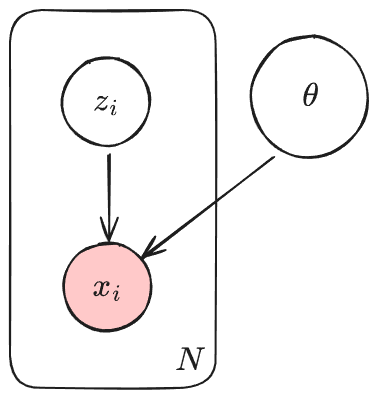
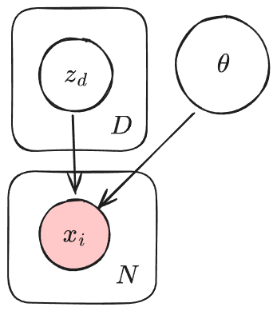

# Proj 2

## Abstract
* What is the problem this paper addresses?
* Why is it an important problem?
* Why are current approaches insufficient?
* Methods: In this work, we develop an approach to address these deficiencies

This paper addresses the high computational cost of diffusion modelling. This is an important problem because pixel space diffusion requires forward passes over very high dimensional inputs (high resolution images), which makes training and inference very expensive, slows down image generation, and restricts maximum model size and input resolution. Furthermore, current diffusion models waste capacity modelling imperceptible, high frequency details in pixel space. To address these limitations, the authors develop Latent Diffusion Models, a class of 2-stage diffusion models that learn a mapping between pixel space and a low dimensional latent space, and perform diffusion only in that latent space. The resulting model is more computationally efficient and scalable, since all diffusion steps occur in latent space, and only a single forward pass of the decoder is required to reconstruct the final image in pixel space.

## Problem definition
* What question are you trying to solve?
* Observed and unobserved random variables?
* What is the goal of the project?

We aim to develop a generative model that can learn a probability distribution $P(x)$ over images $x\in D$, where $x$ is an image in our data set $D$, to generate images similar to what's in $D$. For this project specifically, we plan to use the MNIST dataset, where each image lies in a high dimension pixel space $\mathbb{R}^{28\times28}$. Diffusion models can generate images, but they operate on pixel values. Each image in MNIST has 784 pixels, and running a diffusion in the pixel space is inefficient because each diffusion step has to process all 784 dimensions. The main question we are trying to address is how we can model $P(x)$ efficiently by avoiding the high computational cost of performing diffusion directly in the pixel space?

To address this, we introduce a latent variable model in which we learn a lower dimensional representation (through a variational autoencoder (VAE)) of a smaller latent vector, $z_0$ of images and perform diffusion in this latent space. After the reverse diffusion process, $z_0$ is decoded back to the pixel domain to produce a generated image $\hat{x}$.

**Observed Variables**
* $x\in\mathbb{R}^{28\times28} \Rightarrow$ Each image of MNIST. These are drawn from an unknown distribution.
* $y\in\{0,1,\ldots,9\} \Rightarrow$ Class labels used for the evaluation of generated images.

**Latent Variables**
* $z\in\mathbb{R}^d \Rightarrow$ A compressed latent representation of the image produced by a VAE, whose dimension, d, is less than 784.
* $z_t$ for $t\in\{1,2,..,T\} \Rightarrow$ The latent representation of the image after $t$ steps of the forward diffusion process, where $T$ is the total number of diffusion steps.
* $\epsilon \sim N(0,I) \Rightarrow$ Noise injected during the forward and reverse diffusion process.

To reduce the cost of running the diffusion process in the pixel space, we first map each image $x\in D$ to a lower dimensional latent vector $z_0$ using a VAE

$$ z_0 \sim q_\phi(z_0 | x) $$

In the latent space, we define a forward diffusion process that adds noise gradually,

$$ q(z_t \mid z_{t-1}) = N\left(\sqrt{1-\beta_t}\, z_{t-1},\; \beta_t I\right), \qquad t = 1,\dots,T $$

Using the reparameterization trick, we can obtain a closed form for the forward process,

$$ z_t = \sqrt{\bar{\alpha}_t}\, z_0 + \sqrt{1 - \bar{\alpha}_t}\, \epsilon, \qquad \epsilon \sim N(0,I) $$

where,

$$ \bar{\alpha}_t = \prod_{i=1}^t (1 - \beta_i) $$

so that,

$$ q(z_t \mid z_0) = N\left(\sqrt{\bar{\alpha}_t} z_0, (1 - \bar{\alpha}_t) I \right) $$

During training, the diffusion model learns to predict the noise added to $z_0$. We denote the noise prediction by

$$ \epsilon_\theta(z_t,t) $$

The decoder maps the final denoised latent $z_0$ back to pixel space,

$$ \hat{x} \sim p_\psi(x | z_0) $$

The full generative process of our latent diffusion model is,

$$
z_T \sim N(0,I) \to 
z_{T-1} \to
\ldots \to
z_0 \to 
\hat{x}
$$

To train the latent diffusion model, we want to minimize over an objective loss function. The total objective is,

$$
L = \mathbb{E}_{z_0 \sim q(z_0\mid x),\ \epsilon \sim N(0,I),\ t \sim \mathrm{Unif}\{1,\dots,T\}}
\left[ \ \|\, \epsilon - \epsilon_\theta(z_t, t)\, \|^2 \ \right]
\quad
\text{where}
\quad
z_t = \sqrt{\bar{\alpha}_t}\, z_0 + \sqrt{1 - \bar{\alpha}_t}\, \epsilon.
$$

Our goal is to show that diffusion in a compressed latent representation using a VAE can reduce computational cost and speed up generation while retaining image quality. The final system should be able to encode $x\in D$ to $z$, perform forward and reverse diffusion in latent space, decode the final latent vector into the pixel domain. 

## Models and Methods
* Describe the model and inference algorithms.
* Graphical and generative model.
* What parameters do we estimate and how?
* What is the interpretation of those parameters, how do they solve the problem?

The Latent Diffusion Model is made up of 2 parts: an autoencoder for perceptual compression and a denoising U-Net for diffusion.

### Autoencoder
The authors tested 2 autoencoders, a VAE (Variational Auto Encoder) and VQ-GAN (Vector-Quantized Generative Adversarial Network). Keep in mind that the purpose of the autoencoder is to compress images into a smaller latent space so diffusion can run more efficiently, while losing as little image fidelity as possible. Both autoencoders are trained first (via SGD), separately from diffusion model and fixed during diffusion model training.

#### VAE
VAEs have 2 parts: an encoder that probabilistically compresses inputs into latent factors (or codes), and a decoder that reconstructs the sampled latent codes back into image space. Classic VAEs minimize the following objective:

$$L = -\mathbb{E}_{z \sim q_\phi(z | x)} \log p_\theta(x | z) + \text{KL} \left[ q_\phi(z | x) || p(z) \right]$$

The first term $L_{recon} = -\mathbb{E}_{z \sim q_\phi(z | x)} \log p_\theta(x | z)$ is the reconstruction loss (how likely is the image $x$ that was reconstructed from the sampled latent code $z$?), which encourages the VAE to output realistic images.

The second term $L_{reg} = \text{KL} \left[ q_\phi(z | x) || p(z) \right]$ penalizes the VAE for latents $z$ that deviate from the prior $p(z)$. A commonly used prior is $p(z) = N(0, I)$, which encourages the model to learn a disentangled latent space that essentially decomposes the high dimensional input space into the product of independent Gaussian features.

$\text{VAE generative model:}$  
$ \cdot \text{ sample latents: } z \sim N(0, I)$  
$ \cdot \text{ reconstruct (decode) latents into images: } x \sim p_\theta(x | z)$  

The authors use a modified VAE with

$$L_{recon} = \lambda_{L1} ||x - \mu_\theta(z)||_1 + \lambda_{per} \text{LPIPS}(x, \mu_\theta(z)) + \lambda_{adv} L_{adv}$$

The first term $\lambda_{L1} ||x - \mu_\theta(z)||_1$ is just the L1 loss between the image $x$ and the reconstructed image $\mu_\theta(z)$. The authors chose to use an L1 instead of L2 loss because they found that using an L1 loss made images less blurry (L2 is minimized by the mean value, which for images, is gray and blurry, while L1 is minimized by the median value).

The second term $\lambda_{per} \text{LPIPS}(x, \mu_\theta(z))$ is the perceptual loss term. LPIPS is the Learned Perceptual Image Patch Similarity defined as $\text{LPIPS}(x, \hat x) = \sum_l w_l ||\phi_l(x) - \phi_l(\hat x)||^2$, where $\phi_l(x)$ are the intermediate layer activations of some pretrained neural network (VGG-16). This loss term encourages the reconstruction to have similar deeper features to the original image, features at a higher level of abstraction compared to pixels (like textures) that the pretrained neural network learned.

The final term $L_{adv} = - D(\mu_\theta(z))$ is the patch-based adversarial loss, where $D$ is the GAN discriminator that must predict if the patch is real or generated. This patch-based adversarial loss forces the VAE decoder to generate sharp, realistic looking patches, patches indistinguishable from ones coming from real images.

#### VQ-GAN
The VQ-GAN is very similar to the VAE modified with adversarial loss as described above. The major difference is that the encoded latents are no longer continuous, but instead come from a discrete set of learnable embeddings (codewords). Encoded image latents are quantized to the closest (based on L2 distance) codewords, and the decoder only ever uses the quantized codewords to reconstruct the input image. The only additional loss term is $L_{quant} = || \text{sg}(z_q) - z ||^2$, where $z_q$ is the quantized latent and $\text{sg}$ is the stop gradient operator (codewords are updated using EMA and not gradients in more recent versions of VQ-VAE). This loss term is called the commitment loss, and pushes the encoder to use latents in the codebook (commit to them).

$\text{VQ-GAN generative model:}$  
$ \cdot \text{ sample latent codewords: } z \in \{z_1 .. z_D\}$  
$ \cdot \text{ reconstruct (decode) latent codewords into images: } x \sim p_\theta(x | z)$  

### Diffusion model
The backbone of the diffusion model is a residual U-Net. Time embeddings are added to intermediate activations to condition the diffusion model on time. Domain-specific conditioning is done through cross-attention at intermediate U-Net layers. Domain specific encoders (ie unmasked transformer for text) embed token-based conditioning information to be fed into cross-attention.

## Results and Validation
* What will your results show?
* How will you quantify how well your approach answered the question?
* What other models and methods will you compare against?
* How do you validate your answers and uncertainty?
* What figures/tables will you use?

Our results will show whether diffusing in a low dimensional latent space is helpful compared to running diffusion directly on pixels. Our primary goal is to evaluate is whether the latent diffusion model (LDM) can still generate realistic images. If the samples are blurry or inconsistent, then reducing the dimensionality would not be worth it. Then, we will test if the runtime improves.

To measure how well the model generates images, we will use Frechet Inception Distance (FID), which measures the distance between the distribution of generated images and distribution of real images. Lower FID means the model is generating higher quality images. We will also check for precision, which tell us how often the samples look like actual MNIST digits, letting us know if our model captures the structure of MNIST. We will look at recall, which tells us whether we are covering the entire range of digits.

<!-- can add some other methods that appear in the paper (GAN, autoencoders, etc) but currently only baseline diffusion -->
We will compare against our LDM other image generation models with a baseline  that operates directly in pixel space. We will look at the training time per iteration, generation speed, and memory usage. Since the latent space has fewer dimensions than the raw image, we expect the diffusion to be faster and less memory intensive. If the LDM achieves similar FID, precision, and recall but is noticeably faster and more memory efficient, then the approach is successful.

We will include generated images from both models, tables with the FID, precision, recall, and resource usage, and a plot comparing the training and generation time. 
